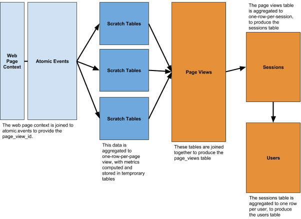
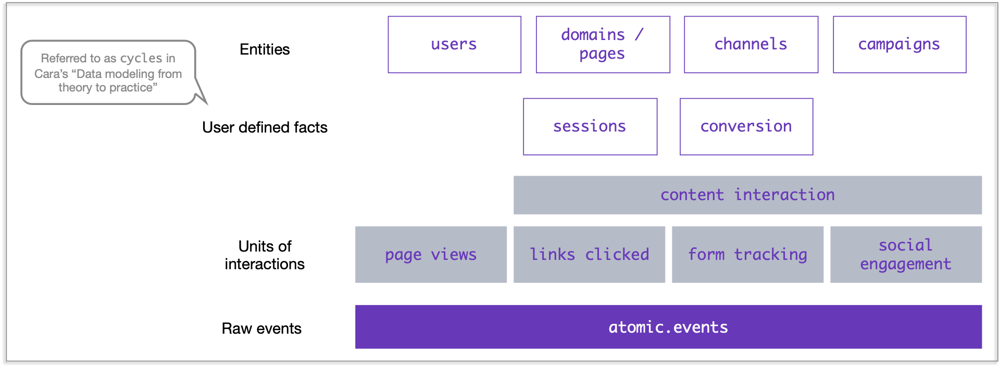
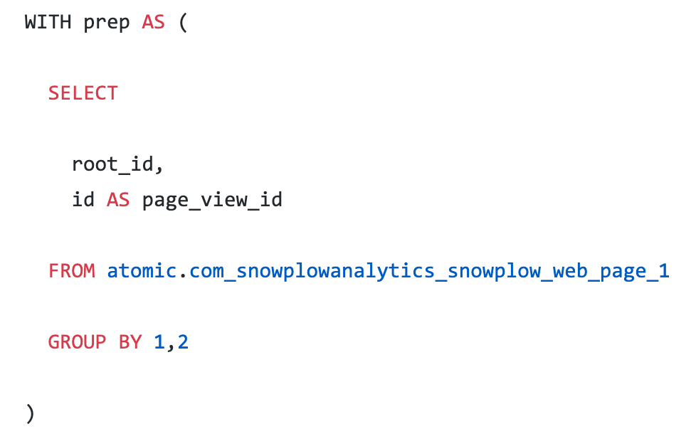

# Modeling Snowplow web events

## Context

This document sets out to review and critique a data model created to work with Snowplow web event data, [found here](https://github.com/snowplow/snowplow-web-data-model). Full details of the task can be found [here](https://gist.github.com/carabaestlein/790ff83e3317a4c52cf2a4183d7c0337).

_Note;_ I have intentionally gone fairly light in terms of writing lots of pseudo SQL code as I imagine this would be fairly dull for the reviewer. I hope it does not give the impression I'm not capable of doing so.

## Things to consider

Before reviewing the model there are a number of criteria, constraints or simple thoughts we want to consider.

(1) Snowplow allows users to define custom events and entities in the data collected. This introduces huge flexibility and complexity in the data, it will not be possible to create data models that cater to all use cases. We therefore borrow the concept of `parametric polymorphism` from functional programming, and perhaps `parsimonious modeling` from statistics. We aim for the models we build to be as generalisable as possible, using the fewest number of parameters, providing a layer of abstraction that consumers of the data can build upon or alter to suit their use case.

* As a result, we'll avoid "modeling macro events from micro events" or creating specific "units of work" as described [here](https://snowplowanalytics.com/blog/2016/03/16/introduction-to-event-data-modeling/#workflows)

(2) The data models must confirm to the principles of `tidy data` [_ref_](https://vita.had.co.nz/papers/tidy-data.pdf). For example;

> 1. Each variable forms a column.
>
> 2. Each observation forms a row.
>
> 3. Each type of observational unit forms a table.

(3) The models must only make use of Snowplow default events [docs](https://github.com/snowplow/snowplow/wiki/2-Specific-event-tracking-with-the-Javascript-tracker).

(4) The models will be designed to run on Snowplow's [SQL runner](https://github.com/snowplow/sql-runner#sql-runner).
* _thinking aloud;_ the SQL runner might allow us to make use of templating, (it uses Golang's "text template processor"), allowing users to set variables to define common dimensions, such as sessions, or use `for loops` which may help with "shredding".

(5) It's not clear if there is significance in being assigned the Redshift model. Redshift does not separate storage and compute, so it may be best to create additional aggregated models. However, it's assumed Redshift was selected due to its inability to play nice with arrays.

### Assumptions

The tracker is implemented correctly. _We could introduce asserts to validate that assumption, though best to introduce something like [Great Expectations](http://greatexpectations.io/)_

One example of defensive programming would be in the `prep` CTE in `00-sessions.sql`, where the following logic should be equal;

`COUNT(*) AS page_views` == `MAX(page_view_in_session_index)`

## The approach

(1) Think backwards. Start at a high-level view of the tables produced. To what extent are we able to ask the types of questions we might expect to be typical for web event data?

(2) Once we have an idea of how we want the data to be structured, work up from the most granular level `atomic.events` and review decisions made in the SQL code.

(3) Tidy up. Ben Stancil has a great video on "the data scientist's hierarchy of needs" [here](https://www.youtube.com/watch?v=Zy3r4h_gAi4), which highlights the importance of good naming conventions and standard formats. When you live in the data as the consumers of this data model typically will, it makes a difference.

-----

## Evaluation

### Thinking backwards

This is the structure of the original Snowplow web model

> The web model aggregates Snowplow atomic data to to a page view level, then aggregates that data to a session and user level, to produce three derived tables (page_views, sessions, users):



**(1)** Expanding the data model in terms of entities and interactions

Intuitively, we would want to model additional common entities. Consumers of the data will likely want to look at the data from additional perspectives. The existing structure of `page views` >> `sessions` >> `users` provides a lens that allows us to answer a broad set of questions, however, some consumers of the data will be more focused on the content itself or acquisition. These additional use cases require us to introduce generalisable entities that help us answer common questions. For example, "_where are our visitors coming from?_", or "_which web pages are most popular?_" Note, we've intentionally referred to _visitors_ and not _customers_ because we lack the business context of a "conversion event".

Three models come to mind, `channels` and `domains` (domain referring to the content, i.e. the website and pages), `campaigns`

* `channels` would be provide a number of statistics across referer and marketing features one a daily basis and would be valuable to those focused on acquisition
  * the default mapping of channels would align with Google's definitions [here](https://support.google.com/analytics/answer/3297892?hl=en)
* `domains` would allow us focus on engagement statistics and how particular content is performing (both in terms of popularity and effectiveness - how does the content correlate with objectives such as conversion or referrals)
* whereas `channels` is focused different routes of acquisition, `campaigns` would be a more granular performance of paid traffic

The following is an illustrative example for `channels`, and could be improved by being more opinionated (such as removing columns).

Initially we would need to add to or embellish the following CASE WHEN statement in `06-page-views.sql`

```SQL
    CASE
      WHEN a.refr_medium IS NULL THEN 'direct'
      WHEN a.refr_medium = 'unknown' THEN 'other'
      ELSE a.refr_medium
    END AS referer_medium
```

* Poplin Data have a fairly chunky CASE WHEN statement in their blog series on modeling event data [here](http://poplindata.wpengine.com/data-modelling/modelling-your-snowplow-event-data-part-3-sessions/) but contains a number of examples only relevant to them
* dbt's Segment package makes use of a CSV which then maps the raw data to a common definition [here](https://github.com/fishtown-analytics/segment/blob/master/data/referrer_mapping.csv)
* for Snowplow this could be defined in a YAML file and parsed through

```SQL
DROP TABLE IF EXISTS web.channels_tmp;
CREATE TABLE web.channels_tmp
  DISTKEY(user_snowplow_domain_id)
  SORTKEY(page_view_start)
AS (

    SELECT
        DATE_TRUNC('day', session_local_time::date) AS local_time__date

        -- referer
        , referer_url
        , referer_url_scheme
        , referer_url_host
        , referer_url_port
        , referer_url_path
        , referer_url_query
        , referer_url_fragment
        , referer_medium
        , referer_source
        , referer_term

        -- marketing
        , marketing_medium
        , marketing_source
        , marketing_term
        , marketing_content
        , marketing_campaign
        , marketing_click_id
        , marketing_network

        , COUNT(DISTINCT user_snowplow_domain_id) AS users
        , COUNT(DISTINCT attributed_user_id) AS attributed_user  # we come on to user stitching later
        , SUM(user_engaged) AS users_engaged
        , SUM(user_bounced) AS users_bounced
        , SUM(time_engaged_in_s) AS time_engaged_in_s
        , SUM(engaged_page_views) AS engaged_page_views
        , SUM(bounced_page_views) AS bounced_page_views
    FROM web.sessions_tmp
    GROUP BY 1,2,3,4,5,6,7,8,9,10,11,12,13,14,15,16,17,18
);
```

Due to the rich nature of interactions now available on the web we need to introduce additional units of interactions.

Reading through the [docs](https://docs.snowplowanalytics.com/docs/collecting-data/collecting-from-own-applications/javascript-tracker/tracking-specific-events/), "link clicking", "form tracking", and "social tracking" appear to be useful units of interactions we could model "out of the box". Rather than writing psuedo code for these models, I've cheated a little and provided a picture of structure in mind.

* links clicking - gives us a view of content interaction and engagement
* form tracking - provides granular information of interacting with a form and submitting a form
* social tracking - tells us which objects have been engaged with (liked/shared) through social media widgets



As this is Redshift specific, it may be best to implement these models in a star schema. Though I would by default lean towards implementing the model as large flat tables, increasing duplication but optimising for the consumer.

Not being extremely familiar with Snowplow's Javascript tracker, I think it would be unwise to try and add tables (such as `products`) that I think would be very context specific.

**(2)** User stitching

Introducing "user stitching". In order for companies to assign historic events to users who become known at a later date, we want to introduce user stitching into `06-page-views.sql` and other any unit of interaction.

This could be done within the same model, by adding the following logic and encapsulating the existing model as a CTE;

```SQL
LAST_VALUE(user_id ignore nulls) over (
            PARTITION BY domain_userid
            # if not performed in `06-page-views.sql`
            # use collector_tstamp
            ORDER BY b.min_tstamp
            rows between unbounded preceding and unbounded following
        ) AS user_id
```

Then creating an attributed `user_id`

```SQL
SELECT COALESCE(user_id, user_snowplow_domain_id) AS attributed_user_id
```

This is an extremely coarse-grain approach.

* The `domain_userid` is useful for customer journeys that involve a single domain
* We might also want to use the IP address `ev.user_ipaddress`
* As fingerprinting was removed in `2.13.0` this approach is perhaps the best solution in most cases

Browsing the web for common approaches, I can see `dbt` create a `snowplow_id_map` model [[_ref_]](https://github.com/fishtown-analytics/snowplow/blob/master/models/identification/default/snowplow_id_map.sql). This approach could be useful as we create multiple units of interaction.

I do worry this window function could get extremely computationally expensive without using some form of "incrementalisation".

### Reviewing from the ground up

In this section, I review each of the existing models in `snowplow-web-data-model/redshift/sql/`

(1) `00-web-page-context.sql` is used in `01-events.sql` to guarantee that all rows have a page view ID.

Does the `prep` CTE (below)



need the `WHERE` clause `WHERE id IS NOT NULL`?

**(2)** `02-events-time.sql` and `03-events-scroll-depth.sql` could be created off the `web_events`as opposed to `atomic.events`

**(3)** I would introduce "time between page view" in `02-events-time.sql`, to allow users to evaluate if the default session logic is relevant to their use case.

```SQL
SELECT
    wp.page_view_id
    , DATEDIFF(second,
        # not 100% confident in this logic
        # may need to use the min_tstamp for each page_view
        LEAST(LAG(ev.derived_tstamp) over(PARTITION BY page_view_id ORDER BY ev.derived_tstamp)),
        ev.derived_tstamp
        ) AS time_between_page_view_in_s
FROM atomic.events AS ev
INNER JOIN scratch.web_page_context AS wp
ON ev.event_id = wp.root_id
WHERE ev.event_name IN ('page_view')

# alternative
WITH base AS (
    SELECT
        page_view_id
        , MIN(ev.derived_tstamp) AS min_tstamp
    FROM atomic.events AS ev
    INNER JOIN scratch.web_page_context AS wp
    ON ev.event_id = wp.root_id
    WHERE ev.event_name IN ('page_view')
    GROUP BY 1
)

SELECT
    page_view_id
    , min_tstamp
    , DATEDIFF(second,
        LAG(min_tstamp, 1) over(PARTITION BY page_view_id ORDER BY min_tstamp),
        min_tstamp
        ) AS time_between_page_view_in_s
FROM base

```

**(4)** `Users` contains only first-touch attribution. Introducing last-touch and some form of multi-touch attribution would require us to understand some level of business logic. For example, what is the event that counts as "conversion" in order for us to define last touch? Equally, the business context will determine the weight and speed of decay (though we could assume a linear attribution by default).

Could use `-var` in SQL Runner to parse the name of the conversion event?

### Tidying up

The following section is a number of small but opinionated changes, I would make when creating the base table `page_views_tmp`. These changes are made in the hope that they make working with the data on a daily basis slightly more enjoyable.

**(1)** Naming conventions

* Change `ti_` and `tr_` ==> `item_` and `txn_`
* Always end with `_id`: `some_thingid` ==> `some_thing_id`
* Gitlab has a good example of naming conventions [here](https://gitlab.com/gitlab-data/analytics/-/blob/master/transform/snowflake-dbt/models/staging/snowplow/month_partition/xf/snowplow_structured_events.sql)
* When naming tables, shorten where necessary but avoid using single letters, i.e. `a, b, c, d, e`

**(2)** Change references of `NVL` to `COALESCE`

#### Introducing more user defined logic

I'm unfamiliar with SQL runner, but it looks to me as though it wouldn't be too complex to use the YAML config files to parse in user defined variables. Default values could be provided for elements such as "engaged" or "session" but these "stories" not "facts" [[ref](https://segment.com/blog/facts-vs-stories-why-segment-has-no-sessions-api/)]

Existing engaged logic

```SQL
CASE 
    WHEN (b.page_views > 2 AND b.time_engaged_in_s > 59)
        OR b.engaged_page_views > 0
    THEN TRUE
    ELSE FALSE
END AS user_engaged

# could become something akin to
CASE 
    WHEN {{ user_engaged_conditions }}
    THEN TRUE
    ELSE FALSE
END AS user_engaged
```

#### Computational improvements

I have no doubt the authors have a greater understanding of the trade-offs and computational complexities in running the models, however the `NOT SIMILAR TO` clause in `06-page-views.sql` could get very computationally expensive.

`SIMILAR TO` performs a regex match, so we can't use something like `WHERE NOT IN (SELECT bad_agents FROM agents`. 


It may require using a for loop, but this would require a templating language, something akin to;

```SQL


WITH unwanted_agents AS (
    SELECT
        page_view_id  # MD5(session_index || page_view_index) AS pk 
        
        , CASE
            WHEN useragent LIKE %{{value}}%
            THEN True ELSE False
        END AS is_unwanted_agent
        
    FROM scratch.web_events
)

# the rest of 06-page-views.sql would be unchanged
# join the CTE on a unique key
# then add to the WHERE clause

AND unwanted_agents.is_unwanted_agent IS False
```

----
