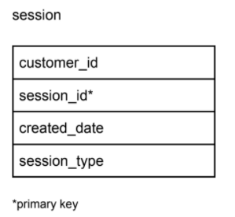
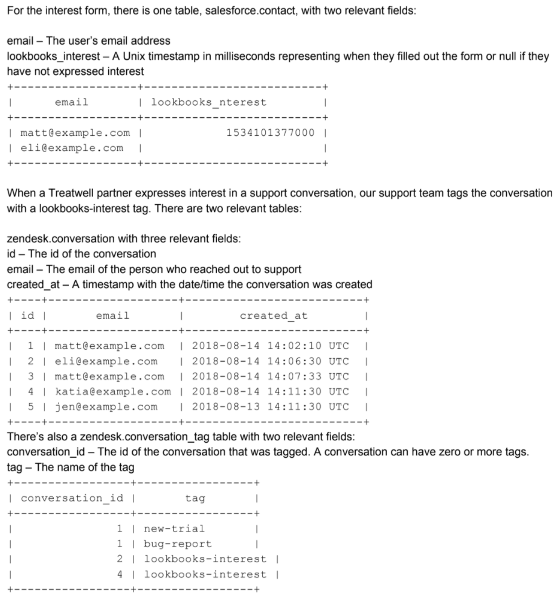

# SQL Test

## Q1

Write an SQL query that returns a set of all sensors (`sensor_id`) with the number of different event types (`event_type`) registered by each of them, ordered by sensor_id in ascending order.

```SQL
create table events
(
sensor_id integer not null,
event_type integer not null,
value float not null
)

SELECT 
	sensor_id
	, COUNT(distinct event_type) num_of_event_types
FROM events
GROUP BY 1
ORDER BY 1
```

## Q2

Write a SQL query to compute the percentage of sessions of type ‘mobile’ per customer, in comparison to each customer’s total sessions.
 
 

```SQL
WITH base AS (
	SELECT 
		customer_id
		, COUNT(distinct session_id) total_sessions
	FROM session
	GROUP BY 1
)	

SELECT 
	customer_id
	, COUNT(distinct session_id)*1.0 / total_sessions pc_of_sessions_on_mobile
FROM session
JOIN base USING(customer_id)
WHERE session.session_type = ‘mobile’
GROUP BY 1
```

## Q3

Write a SQL query to find all numbers that appear at least three times consecutively.

_note; using Redshift dialect_

```SQL
WITH base AS (
	SELECT *
		,LEN(LISTAGG(DISTINCT Num) OVER (ROWS BETWEEN 2 PRECEDING AND CURRENT ROW)) len_three_consec
	FROM a_table
)

SELECT
	distinct NUM
FROM base
WHERE len_three_consec = 1 
```

## Q4

We’re currently in the process of rolling out Lookbooks, a way for hair stylists to post photos of treatments, to existing Treatwell salon partners who have expressed interest trying it.

Treatwell salon partners could have expressed interest in two ways: (1) either by filling out an interest form or (2) mentioning to our support team that they want to try it.



Write a SQL query that combines data from these two sources that lists everyone who has expressed interest in trying Lookbooks and when they first expressed that interest.

```SQL
WITH interest AS (
	SELECT 
		email
		, date_add('ms', lookbooks_nterest, '1970-01-01') expressed_interest_at
	FROM salesforce.contact
	WHERE lookbooks_nterest IS NOT NULL
	UNION ALL
	SELECT 
		email
		, created_at expressed_interest_at
	FROM zendesk.conversation
	JOIN zendesk.conversation_tag
		ON conversation.id = conversation_tag.conversation_id
	WHERE tag = “lookbooks-interest”
)

SELECT
	email
	, MIN(expressed_interest_at) expressed_interest_at
FROM interest
GROUP BY 1
```
